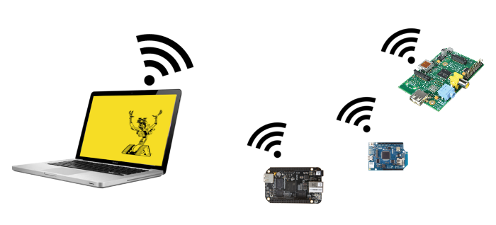

# Remote-io

Remote-io is a Firmata-compatibility IO class for writing [nodebot](http://nodebots.io/) programs and provides remote interaction with any other [Johnny-Five](https://github.com/rwaldron/johnny-five) capable IO class.

Remote-io was built at [IcedDev](http://iceddev.com/)

### Installation

`npm install remote-io`

### Usage



The little devices on the right side of this image are running this common bit of code with an IO class instance specified:

```javascript
var RemoteIO = require('remote-io');

//The "io" variable here could be any instance of bean-io, rpi-io, etc.
io.on('ready', function(){

   //listen for remote firmata messages
   var remoteio = new RemoteIO({
     serial: sp, //any virtual serial port instance
     io: io
   }); 

});

```

Now for the laptop on the left side of the picture, you can simply write johnny-five code that uses a virtual serial port.  Your code uses the typical firmata IO class to talk to the remote-io instances.


```javascript
var five = require('johnny-five');
var firmata = require('firmata');

//The "sp" variable here could be any instance of a virtual serial port
var io = new firmata.Board(sp);

var board = new five.Board({io: io});
board.on('ready', function(){
  var led = new five.Led(13);
  led.blink();
});

```


### API

Remote-io subclasses firmata.js and provides the same API.


